# Bitwise Operations
-   Every arithmatic operation add,subtract,multiply,divide or carried in binary form internally
-   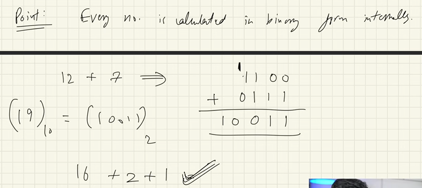

##  My Observation
### AND
    -   if A & B are operands , A & B always returns A if A is 0 / B if A is 1 B is 0
    -   0(A value) & 1(B value) returns 0(A value) 

### XOR & Complement
    - XOR result is true only if atmost A or B is true not both
    - A XOR with any number returns complement(opposite of A) if B is not same as A
        -  0(A value) & 1(B) returns 1(complement of A)
        - A(0) & A(0) returns 0
        - A(0) & 1 returns 1

### Left shift (multiply)
-   moves the digits to the left to specificied b times then replaced the place with 0
-   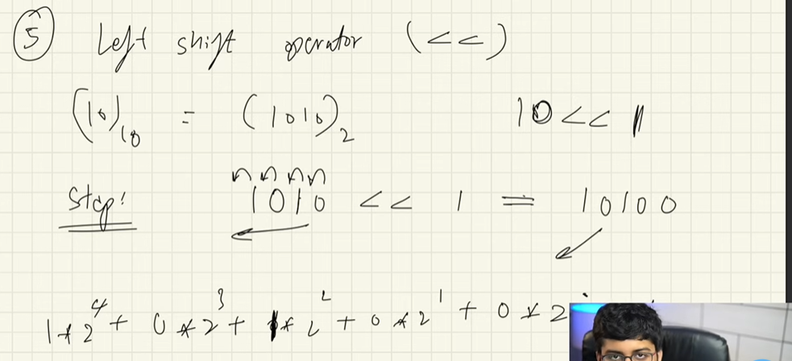
-   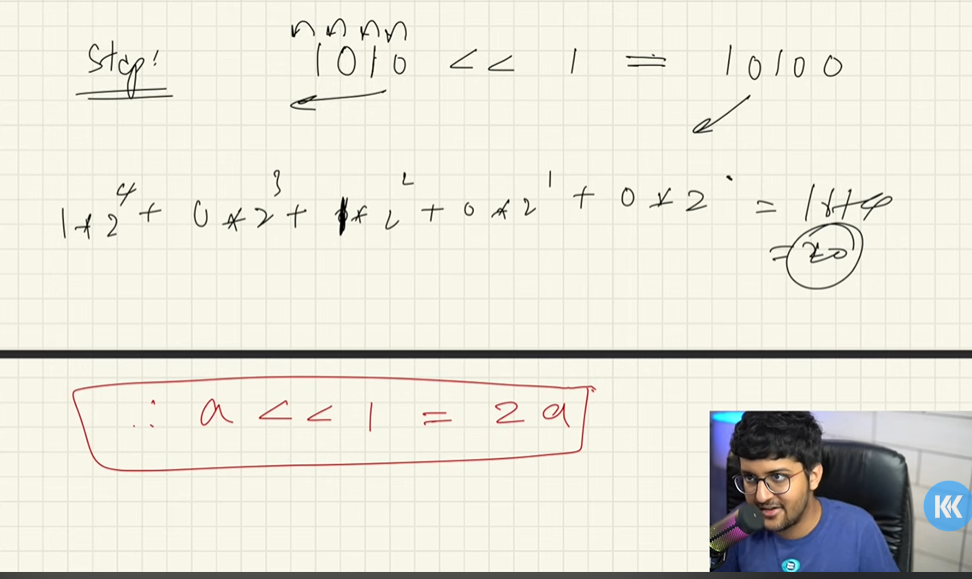
-   if a << b , then a is going to be converted to a * 2^b

### Right Shift (divide)
-   moves the digits to the right
-   if a >> b , then a is going to be converted to (a / 2^b)

### Addition
-   adds the digits of a & b
-   if 1  and 1 is added will result to 10 so it keeps 0 and carries 1 to next addition

## Number systems
-   Decimal - 0 to 9 (we use it in real life day-to-day activities)
-   Octal - 0 to 8
-   Hexadecimal - 0 to 9,A,B,C,D,E,F
-   Binary - 0,1
-   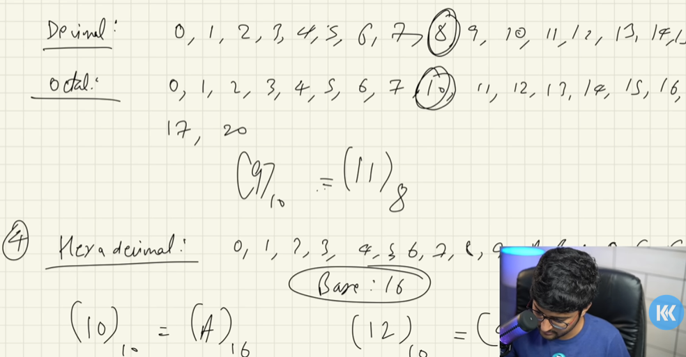

## convert decimal to any base (2/8/16) format
-   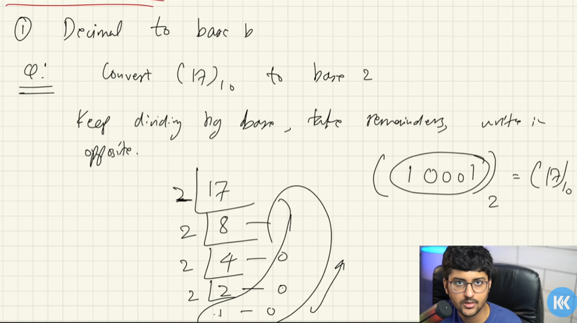

## convert any base to decimal
-  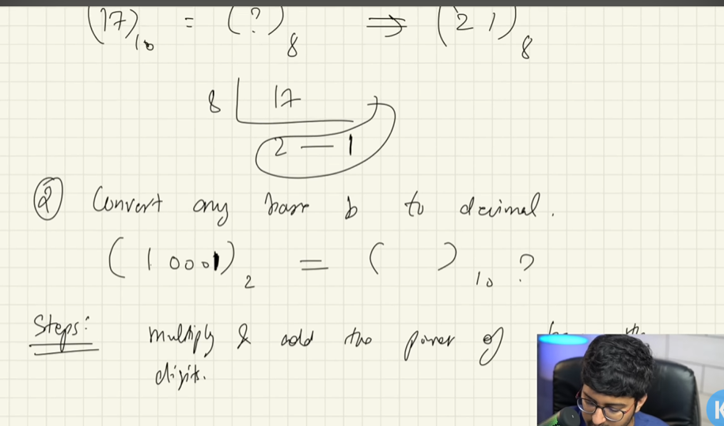
-  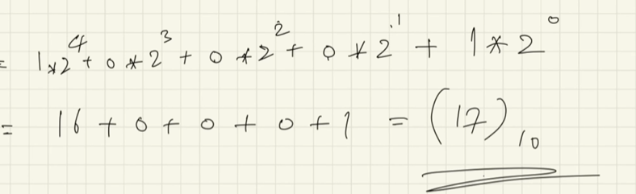

Even or Odd
-   An number is said to odd or even depending on the last digit in binary 
-   evry number after the first binary digit is going to be odd because 2 ^ anything * anything is always even
-   But 2 ^ 0 * odd (1) is 1 and 2^0 * even (0) is even 
  - so any number binary representation last digit is the deciding factor of an number to be odd or not
  - beacuse adding this to previous digits calculation completely changes the evenity /oddity of an no
-   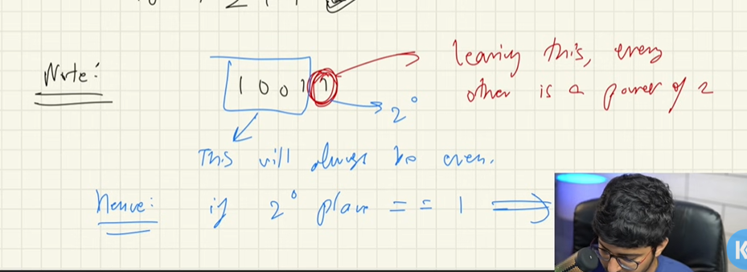

Negative or positive number
-  If the first digit i.e MSB Most Significant Bit start with 1 in binary format
  -Then the number is negative
-  If the first digit start with 0
  - Then the number is positive

- Steps to convert no to negative
- Using 2's complement
- take complement of number (equivalent to 11111111 - 00001010 )
- then add one to the number
- We call this as 2's complement
- Master plan behind 2's complement
- Take power of 2 in binary that has length as such 8 bits can be accomodated and rest is ignored 
- 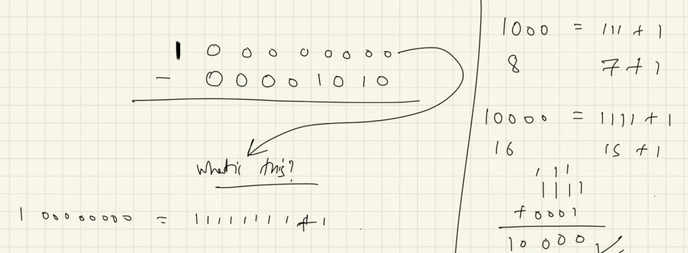
- 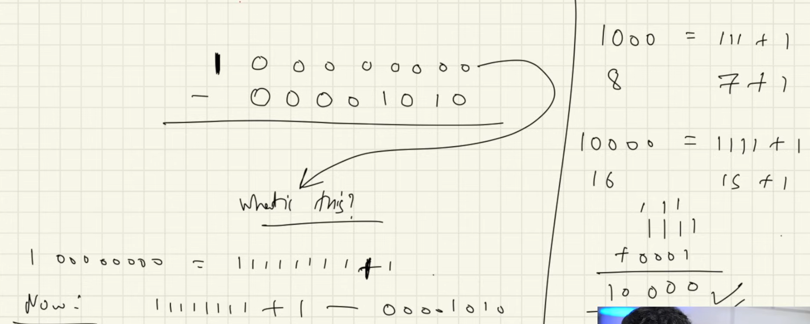

Range of numbers
-   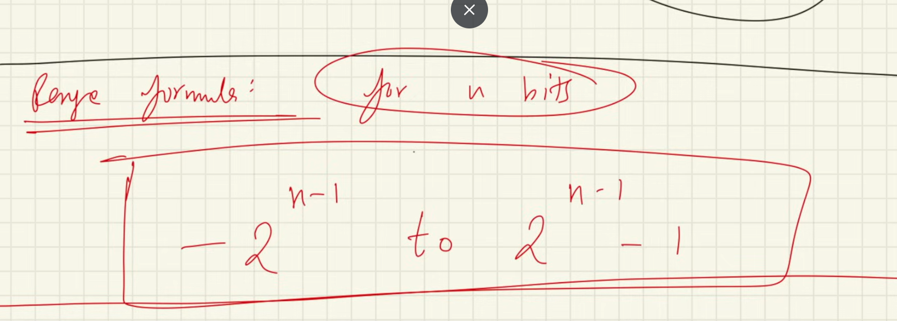

total digits of number in any representation
- 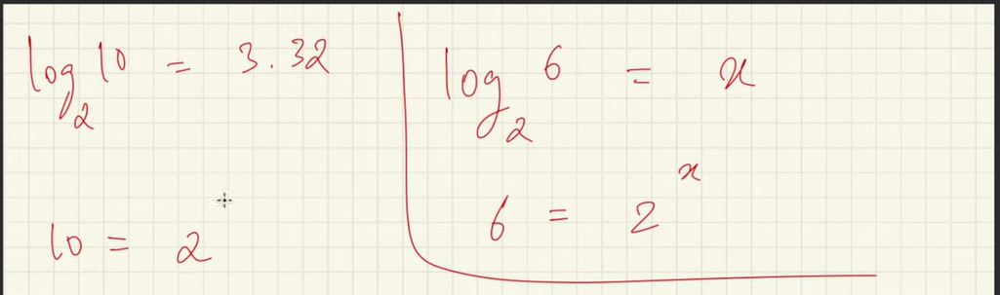
- 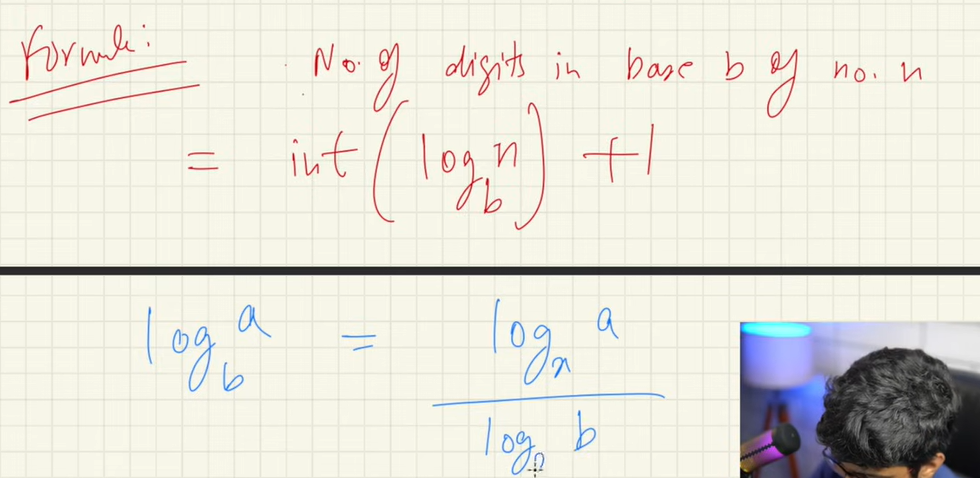

Sum 0f nth row in pascal triangle
- 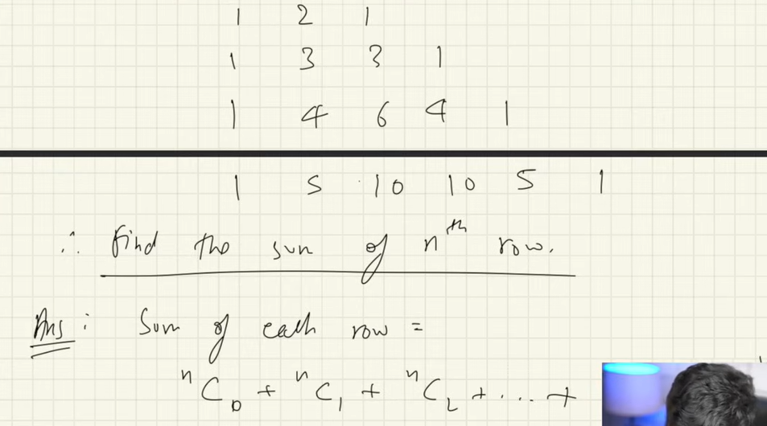
- 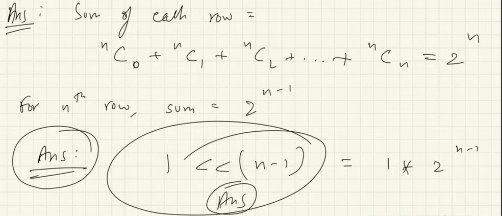

Find number ris power of 2 or not
- If there is only one 1 in the entire 8 digit representation of binary vlaue
- Eg: 2^8 100000000
- Approach
  - 1st app
    - make right shift and identify last digit is 1 and keep counter to count total 1
  - 2nd
      - 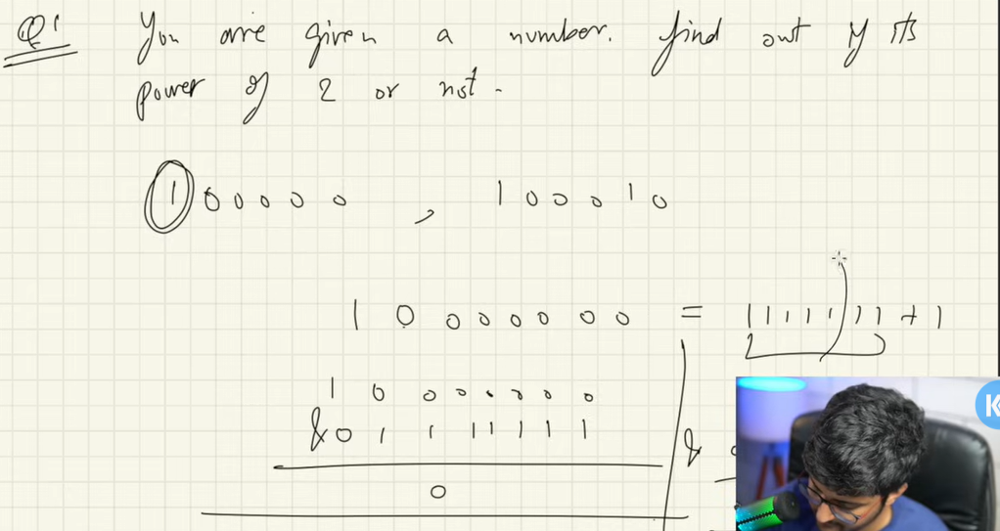
      - 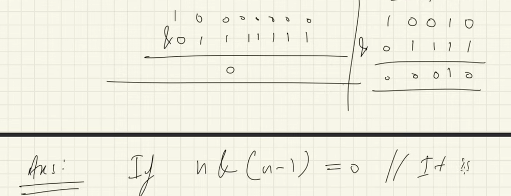
      - 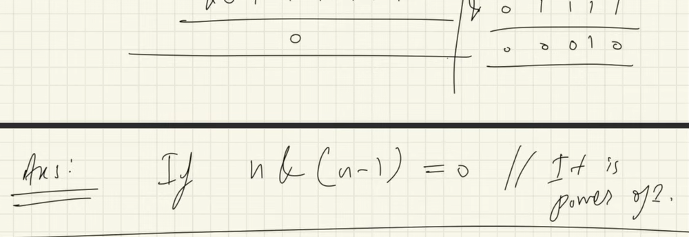

Find the value of a^b 
- 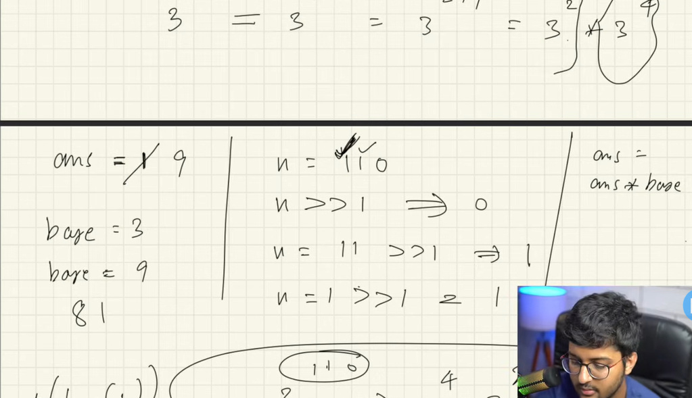