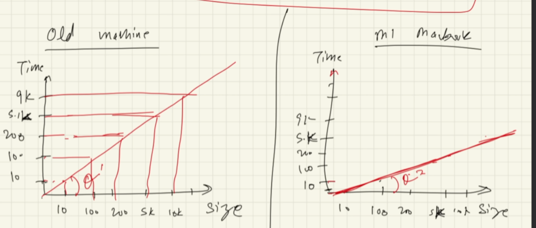
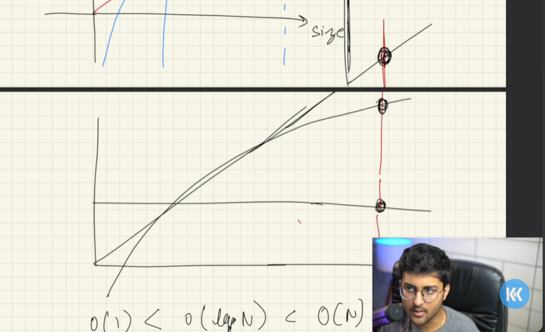
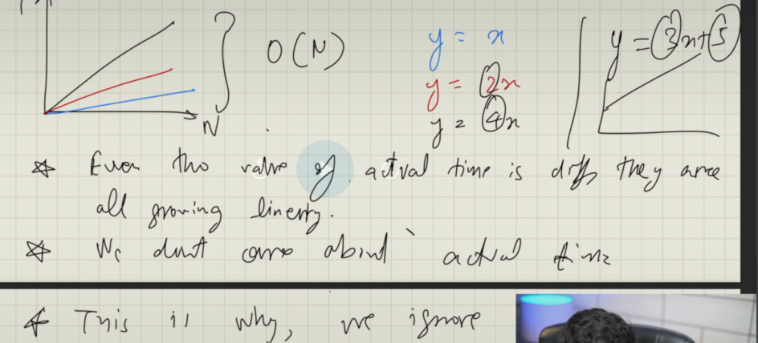
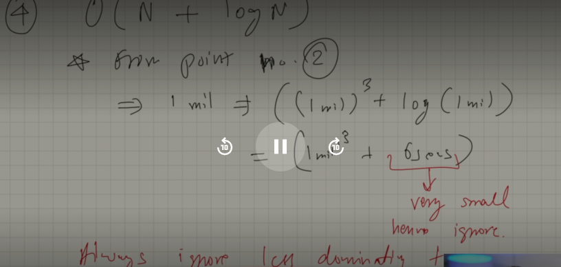
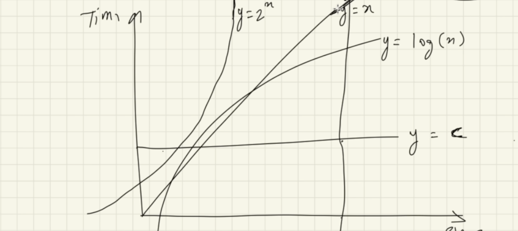
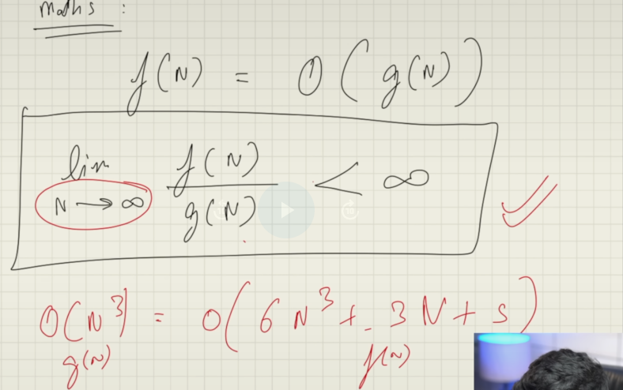
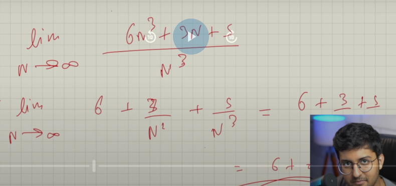

#   Time Complexity
##  time complexity != total time taken

### What is time complexity?
-    It says how the time will grow as the input size grow

### Why ?
-   To understand the performance of the algorithmns with respect to time and input size
    -   

### What do consider when thinking about complexity ?
  - Always look first for worst case complexity 
  - Always take large data size to analyze complexity
    - !
  - we ignore all constants to understand the behavior/pattern of the complexity
  - Always ignore less dominating terms/constants in equation as that value doesn't even matter in the large huge volume of data
    - 
  - Order of complexity as O(1) < O(log(N)) < O(N) < (2^N)
    - 

# Big O ?
  - This says it is the upper bound time complexity
  - i.e the maximum threshold of the complexity of algorithm
  - at any case the time complexity will not exceed  above the specified complexity O(N) for instance
  - if the algorithm is marked as O(n) even how much data you feed it won't increase the complexity from n to n^2

## Maths perspective
-   
-   

My Observation:
  when N tends to infinity , when dividing the eq A with eq B where each has dominence upto N^3 for example it will always lie before the infinity
  So no huge data input could never false the Big(O) complexity of the algorithm

#   Big 
-   It  

