#   Recursion Complexity
-   At any point of time , no two sibiling nodes(each node denotes the function call and its storage in stack) (denoting calls in stack) can be/occur at a time
-   In an stack if there are multiple entries for different nodes then each one should be interlinked(waiting for the child recurrsive call to complete) to another
-   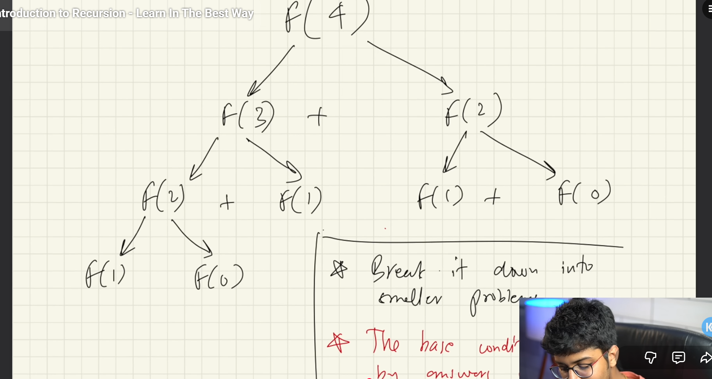

##   Space Complexity
-   Maximum Height of the call tree from root to leaf will always have the maximum space complexity
-   For eg : Fibonacci (n) the auzilary space it will take will be O(n)

##  Types of recurrenece
-   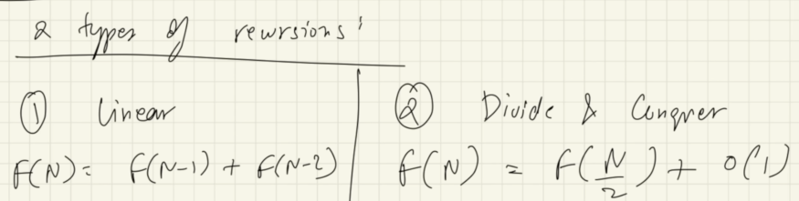

##   Divide and conquere
-   form of representation of recurrence  equation
     -   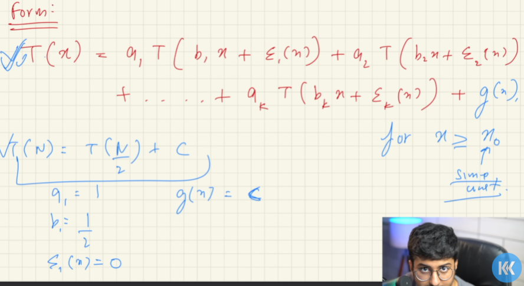
     - What I understood
     - equation combines the answer + what it(return as it is , store and do some other operastions) demands/takes to do with the answer you get
       - 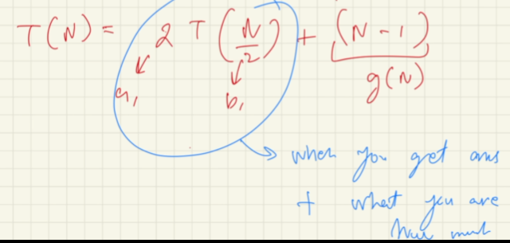

##  Different ways of finding complexity
-   plug & chug
-   master theorem
-   Akra bazzi (1996)

What Akra bazzi ?
-    Eliminates the use of complex master theorem
-    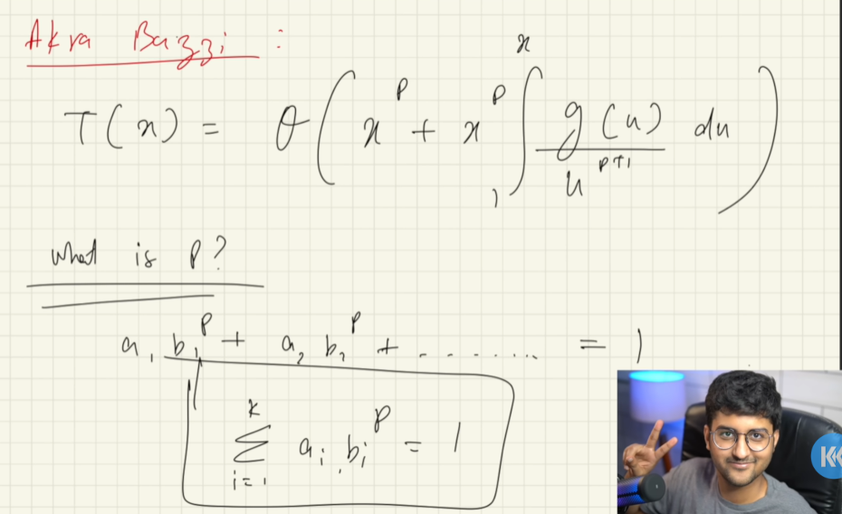
-    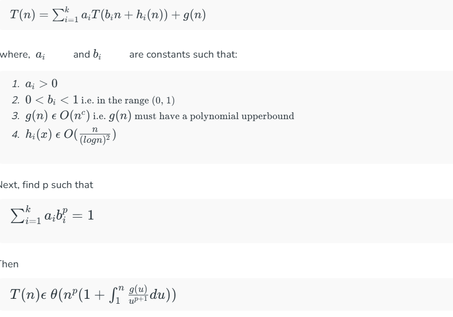

## Applying Akra bazzi to derive time complexity for merge sort
-   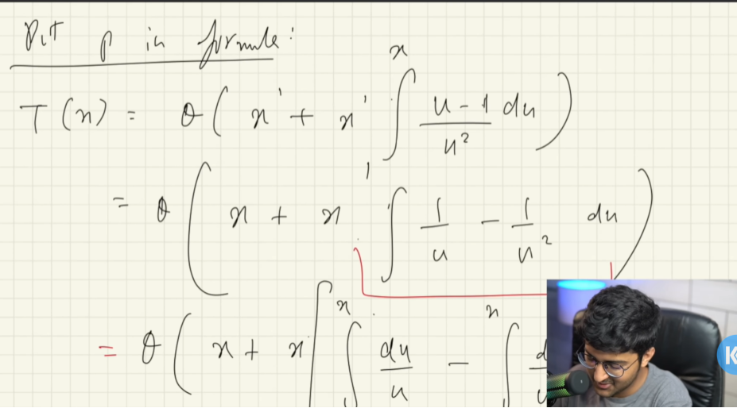
-   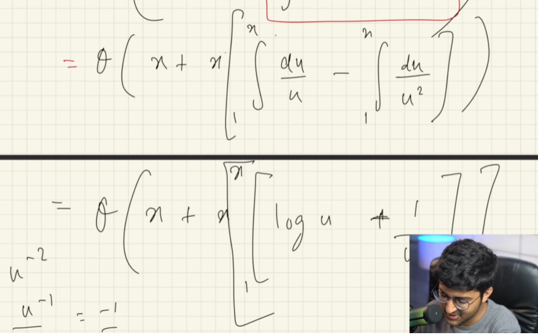
-   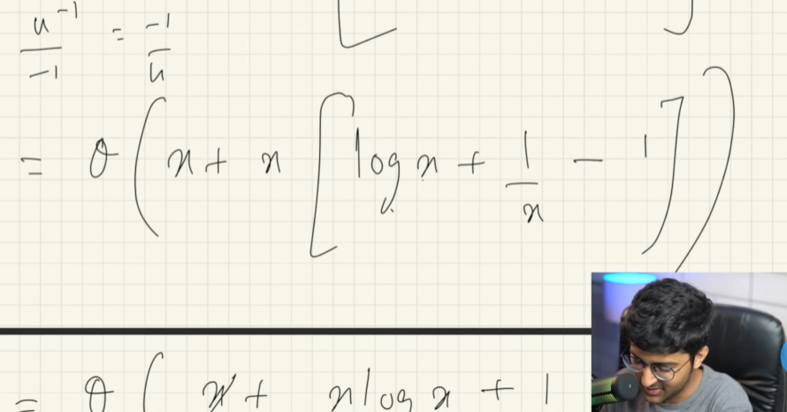
-   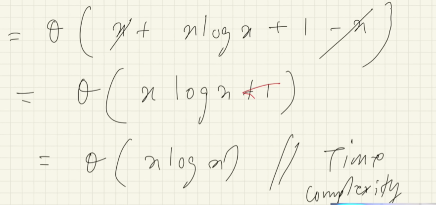

While applying AK method if P is evaluated to be less than G(x) then g(x) will be the answer for complexity
-   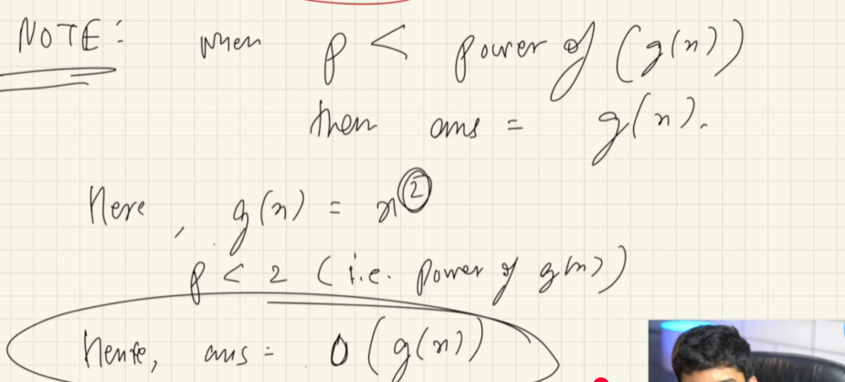

## Applying AK for liner recurrence relation
-   Form of recurrence relation
-   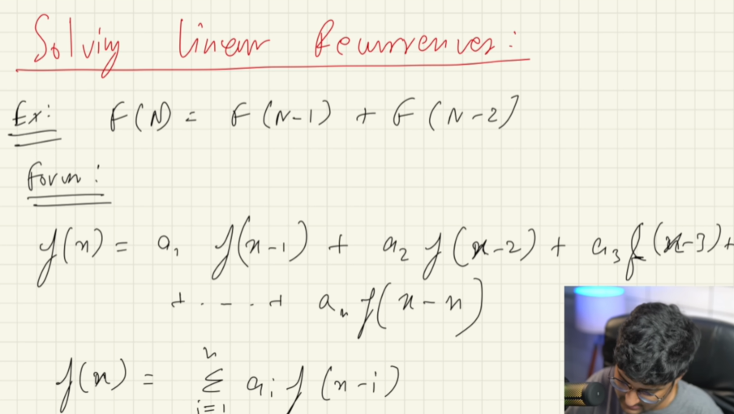

## derive golden ratio & Time complexity with of fibonnacci recurrence relation
-   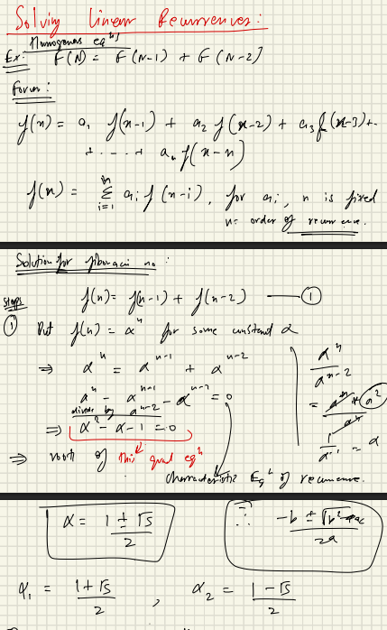
-   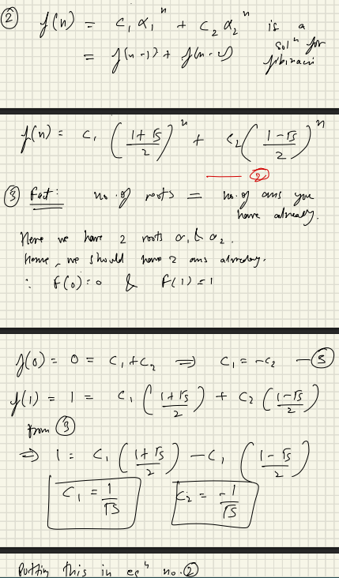
-   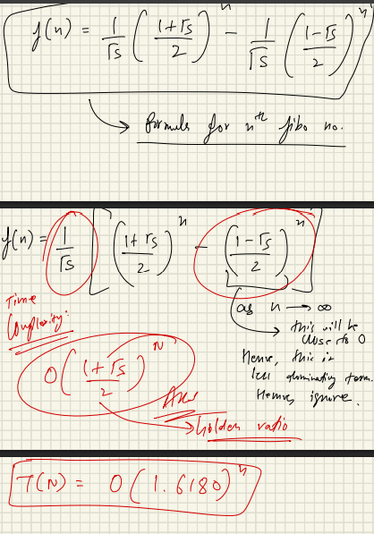
-   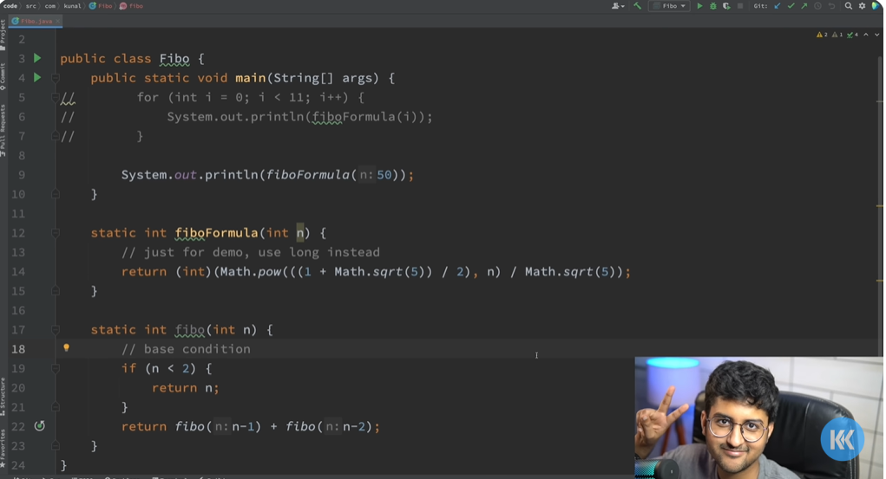

## identify time complexity of  Fibonnaci series
-   f(n) = f(n-1) + f(n-2)
-   i.e O(derived golden ratio by neglecting the less dominating terms)
-   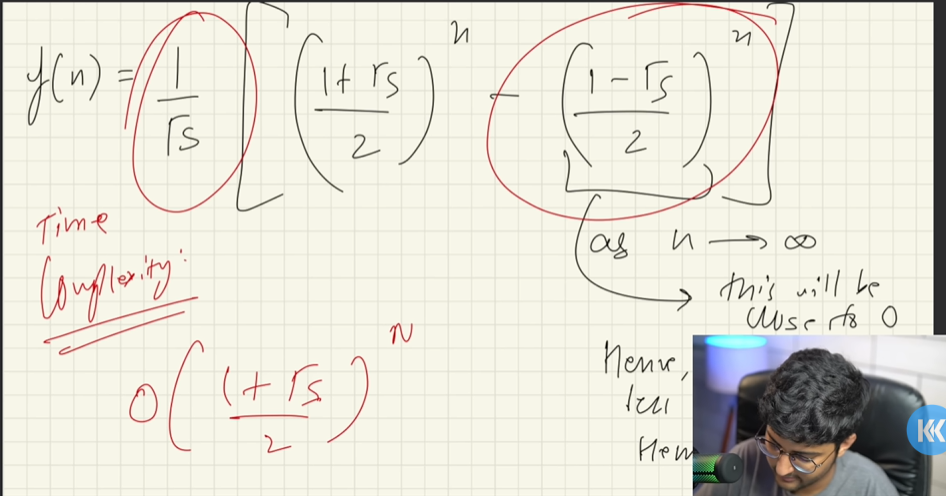

## Types of eqautions
-   homogeneous
  - linear recurrence that has forms of similar type 
    - f(n) = f(n-1) + f(n-2)
      - types of homogenous
        - homegenous with distinct roots
          - after solving getting alpha with distinct root values we are good
        - homogenous with repeated roots
          - after solving getting same root values then take next progression in series
            - 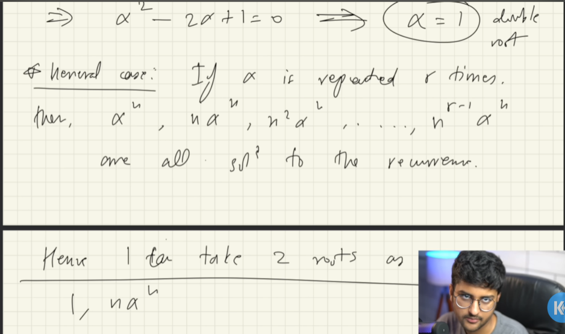
      - how we solve ?
        - use characteric equations approach to find the value of alpha
        - then substitue in the c1*(aplha)^1 + c2*(alpha)^2 (I may need corrections in this note line) 
-   non-homogenous
  - linear recurrences that has similar form + another function like f(x) , g(x) attached to it
    - f(n) = f(n-1) + f(n-2) + g(n)
      - how we solve
        - identify value of f(n) as usual using characteric equation approach by considering g(n) to be 0 
        - now guess the g(n) to be particular value multiplied by constant in rhs and in lhs we have f(n-1)+f(n-2)
        - subsitute constant * particular value in f(n) & f(n-1) and find c 
        - substitute c value in the c1 in original f(n) equation 
      - how to guess the particular value
        - if form has terms
          - exponential like 2^n or 3^n then our guess need to add constant before guess eq a*2^n
          - if polynomial like n^2-1 then  our guess need to be a*n^2 + bn + c
          - if has both exponential & polynomial like 2^n + n then our guess need to be a*2^n + bn + c 
          -if guess fails for exponential with a*2^n then try to increase the equation along with adjusting degree
            - initial a - failed
            - an + b - failed (n with degree 1)
            - an^2 + bn + c - keep trying guessing until we get some value (n with degree 2 here)
